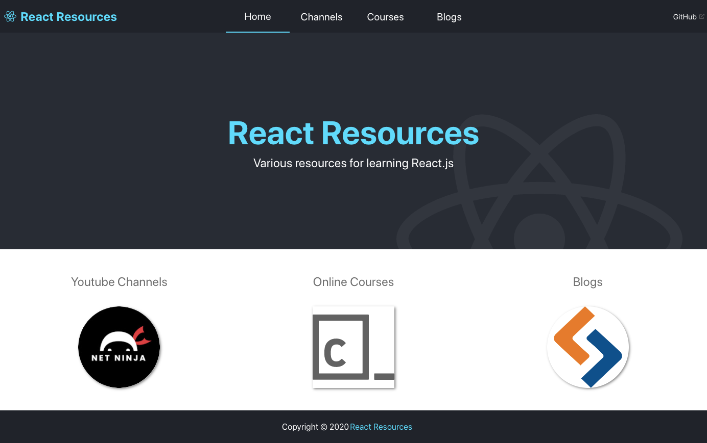

# React Resources



Various resources for learning React.js

[LINK](https://react-resources.web.app/)

## Install

```bash
yarn install
```

## Setup

This project uses the YouTube Data API

Create a developer account and create an API key. Then place API key in ```.env``` file.

```javascript
REACT_APP_YOUTUBE_API= //youtube api
```

## Start

```bash
yarn start
```

## Built With

* [React](https://reactjs.org)
* [Typescript](https://www.typescriptlang.org/)
* [Styled-Components](https://styled-components.com/) (_styles_)

## License

[MIT](https://choosealicense.com/licenses/mit/)
